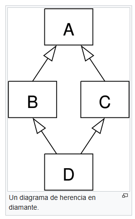

# Herencia

El mecanismo por el que una clase o subclase adquiere propiedades y comportamientos de otra clase.

Permite que la subclase 

##### Nota: una taxonomia es una especie de clasificación

## Importancia

- Reutilización: evita duplicar codigo

- Modularidad: Separar responsabilidades

- Jerarquias: Permite estructurar clases en niveles de generalización/especialización

- Extensibilidad: Puedes agregar funcionalidad sin modificar lo existente.

## Superclase y subclase

### Superclase - Clase padre/madre

Define atributos y metodos generales que pueden ser heredados.

### Subclase - clase hijo/a

Extiende o especializa el comportamientoo de la clase padre, añadiendo metodos o redefiniendo los heredados.

## Tipos de herencia

- **Simple**: Una subclase deriva de una unica superclase

    - Ventajas: Claridad, reutilizacion, mantenibilidad y especialización natural, polimorfismo

    - Limitaciones: Rigidez, Gran dependencia, poco flexible, Profundidad excesiva (en cadenas multinivel).

```cpp
#include <iostream>

class Animal {
    // Virtual destructor for proper cleanup in derived classes (buena practica)
    public: virtual ~Animal() = default;
    
    void respirar() const {
        std::cout << "Breathing..." << std::endl;
    }
};

struct Perro : public Animal
{
    void ladrar() const {
        std::cout << "Woof Woof!" << std::endl;
    }
};

struct Gato : public Animal
{
    void maullar() const {
        std::cout << "Meow Meow!" << std::endl;
    }
};

int main()
{
    Perro dog;
    Gato cat;

    dog.respirar();
    dog.ladrar(); 

    cat.respirar();
    cat.maullar();

    return 0;
}
```

- **Multiple**: La herencia multiple es aquella en la que una subclase deriva de dos o mas superclases.

    - Ventajas: reutilizacion avanzada, flexibilidad, expresividad.
    - Limitaciones: Ambiguedad, complejidad, Incompatibilidad, Sobrecarga de diseño.

```cpp
#include <iostream>

// using namespace std;
using std::cout;
using std::endl;


class Volador {
    public:
    virtual ~Volador() = default;

    void volar(); // Metodo abstracto
};

class Nadador {
    public:
    virtual ~Nadador() = default;

    void nadar(); // Metodo abstracto
};

class Pato : public Volador, public Nadador {
    public:
        void volar() const {
            cout << "El pato esta volando" << endl;
        }

        void nadar() const {
            cout << "El pato esta nadando" << endl;
        }

        void quack() {
            cout << "Quack Quack!" << endl;
        }
};

int main(int argc, char const *argv[])
{
    Pato donald;
    donald.volar();
    donald.nadar();
    return 0;
}

```

Problema de diamante: Ocurre cuando una subclase hereda de dos superclases que a su vezz heredan de una superclase



```py
class A:
    def method(self):
        print("Method from class A")

class B(A):
    def method(self):
        print("Method from class B")
        super().method()

class C(A):
    def method(self):
        print("Method from class C")
        super().method()

class D(B, C):
    def hello(self):
        print("Method from class D")
        super().method()

d = D()

print(D.mro())  # Muestra el orden de resolución de métodos
print("metodo:")
d.method()      # Llama al método, demostrando la resolución correcta
```

- **Multinivel**: Es cuando una clase hereda de otra, y luego una tercera clase hereda de esa segunda, formando una cadena en varios niveles.

```ml
class animal = object
  method eat = print_endline "Eating"
end;;

class mammal = object
  inherit animal
  method feed_offspring = print_endline "alimentando a la cría"
end;;

class dog = object
  inherit mammal
  method bark = print_endline "Woof!"
end;;

let d = new dog;;
d#eat;;
d#feed_offspring;;
d#bark;;
```

- **Jerarquica**:Es cuando varias clases diferentes heredan de la misma clase base.

```ml
class worker (name:string) (income:float)=
  object
    val mutable name = name
    val mutable income = income
    method get_name = name
    method get_income = income
end;;

class chief (name:string) (income:float)=
  object
    inherit worker name income
    method manage_team = print_endline (name ^ " is managing the team")
end;;

class programmer (name:string) (income:float)=
  object
    inherit worker name income
    method code = print_endline (name ^ " is coding")
end;;

class accountant (name:string) (income:float)=
  object
    inherit worker name income
    method manage_accounts = print_endline (name ^ " is managing accounts")
end;;

let jessica = new chief "Jessica" 100.5.;;
let rafa = new programmer "Rafa" 50.5.;;
let jair = new accountant "Jairo" 20.5.;;

jessica#get_name;;
rafa#get_income;;
jair#get_name;;

jessica#manage_team;;
rafa#code;;
jair#manage_accounts;;
```

-  **Hibrida**: Combina dos o mas tipos de herencia en un sistema, es flexible pero aumenta la complejidad y puede generar una jerarquia dificil de mantener.

## Principios

- Modela "Es-un" con herencia publica.

- "Tiene-un / usa-un": prefiere composición.

- Evitar herencia multiple a menos que la necesidad sea evidente

- Evita forzar jerarquiar si la relación no es de subtipad